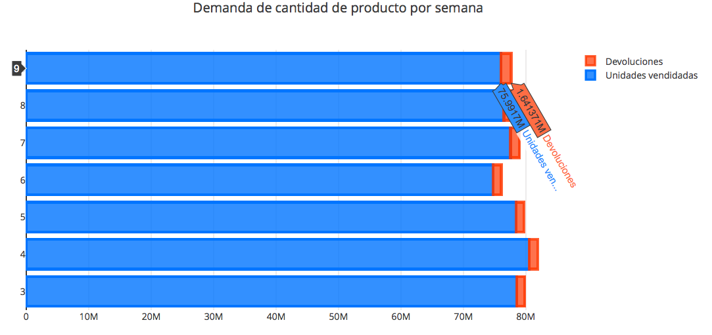
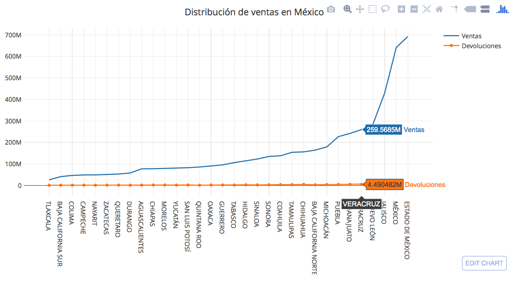
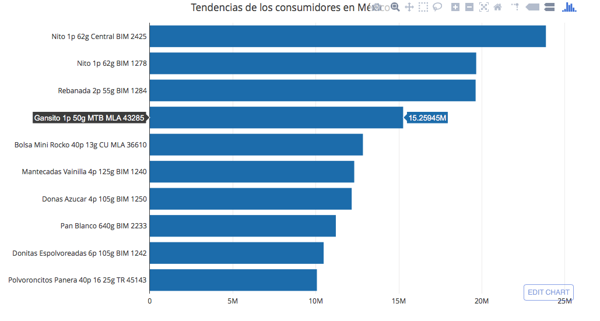
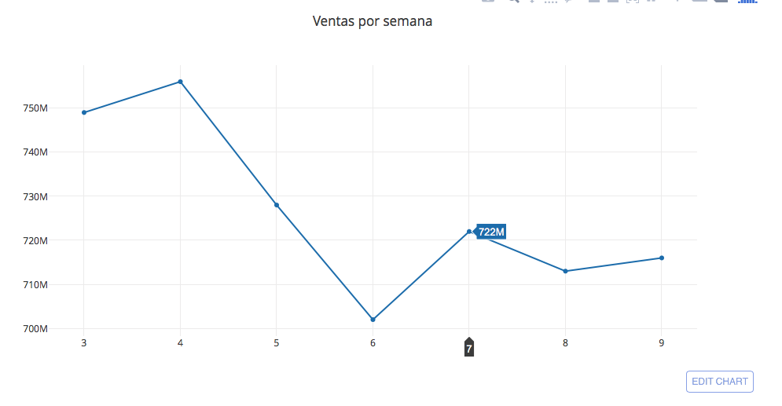

#### PROYECTO 
___
**Preparado para:** Héctor Cuesta Arvizu

**Preparado por:** Karina Daniela Chaires López

Zacatecas, Zacatecas Diciembre de 2017
___


#### 1. Introducción
<p><strong>Grupo Bimbo</strong> debe sopesar consideraciones para anticipar sus ventas, ya que se esfuerza por satisfacer la demanda diaria de los consumidores de productos frescos de panadería en los estantes de más de 1 millón de tiendas a lo largo de sus 45,000 rutas en todo México.

Para ello lanza un reto en <strong>kaggle</strong> <hfer> https://www.kaggle.com/c/grupo-bimbo-inventory-demand <href>, en la cual se pretende desarrollar un modelo predictivo para pronosticar con presición la demanda de inventario.
Como parte de la implementación de herramientas para el análisis de datos, en el presente proyecto solo se tomarán los datasets proporcionados en dicho reto (no se desarrolla solución para el reto antes mencionado).</p>

#### 2. Resumen
<p>Se realizó el proceso para poder responder los siguientes questionamientos:</p>

- Demanda de cantidad de producto por semana.
- Distribución de ventas en México.
- Tendencias de los consumidores en México.
- Ventas por semana.


#### 3. Metodología
- Fuente de datos:<strong> kaggle </strong> 
- Análisis exploratorio:<strong> Notebook Jupyter kernels python3, pandas</strong> 
- Transformación de datos:<strong> Apache Pig version 0.12.0-cdh5.12.0</strong> 
- Almacenamiento:<strong> schema CSV</strong> 
- Procesamiento:<strong> Apache Pig version 0.12.0-cdh5.12.0</strong> 
- Visualización:<strong> Notebook Jupyter kernels python3,  plotly-2.2.3</strong> 

#### 4. Desarrollo 

<blockquote>
<p>ANALIZAR</p>
</blockquote>

File descriptions

- train.csv — the training set
- test.csv — the test set
- sample_submission.csv — a sample submission file in the correct format
- cliente_tabla.csv — client names (can be joined with train/test on Cliente_ID)
- producto_tabla.csv — product names (can be joined with train/test on Producto_ID)
- town_state.csv — town and state (can be joined with train/test on Agencia_ID)

Data fields

- Semana — Week number (From Thursday to Wednesday)
- Agencia_ID — Sales Depot ID
- Canal_ID — Sales Channel ID
- Ruta_SAK — Route ID (Several routes = Sales Depot)
- Cliente_ID — Client ID
- NombreCliente — Client name
- Producto_ID — Product ID
- NombreProducto — Product Name
- Venta_uni_hoy — Sales unit this week (integer)
- Venta_hoy — Sales this week (unit: pesos)
- Dev_uni_proxima — Returns unit next week (integer)
- Dev_proxima — Returns next week (unit: pesos)
- Demanda_uni_equil — Adjusted Demand (integer) (This is the target you will predict)


```python
import pandas as pd
from pandas import DataFrame as df
```


```python
datos = pd.read_csv('DATASET_BIMBO/test.csv')
```


```python
df.info(datos)
```

    <class 'pandas.core.frame.DataFrame'>
    RangeIndex: 6999251 entries, 0 to 6999250
    Data columns (total 7 columns):
    id             int64
    Semana         int64
    Agencia_ID     int64
    Canal_ID       int64
    Ruta_SAK       int64
    Cliente_ID     int64
    Producto_ID    int64
    dtypes: int64(7)
    memory usage: 373.8 MB


```python
df.tail(datos)
```


<div>
<style>
    .dataframe thead tr:only-child th {
        text-align: right;
    }

    .dataframe thead th {
        text-align: left;
    }

    .dataframe tbody tr th {
        vertical-align: top;
    }
</style>
<table border="1" class="dataframe">
  <thead>
    <tr style="text-align: right;">
      <th></th>
      <th>id</th>
      <th>Semana</th>
      <th>Agencia_ID</th>
      <th>Canal_ID</th>
      <th>Ruta_SAK</th>
      <th>Cliente_ID</th>
      <th>Producto_ID</th>
    </tr>
  </thead>
  <tbody>
    <tr>
      <th>6999246</th>
      <td>6999246</td>
      <td>11</td>
      <td>2057</td>
      <td>1</td>
      <td>1153</td>
      <td>4379638</td>
      <td>1232</td>
    </tr>
    <tr>
      <th>6999247</th>
      <td>6999247</td>
      <td>10</td>
      <td>1334</td>
      <td>1</td>
      <td>2008</td>
      <td>970421</td>
      <td>43069</td>
    </tr>
    <tr>
      <th>6999248</th>
      <td>6999248</td>
      <td>11</td>
      <td>1622</td>
      <td>1</td>
      <td>2869</td>
      <td>192749</td>
      <td>30532</td>
    </tr>
    <tr>
      <th>6999249</th>
      <td>6999249</td>
      <td>11</td>
      <td>1636</td>
      <td>1</td>
      <td>4401</td>
      <td>286071</td>
      <td>35107</td>
    </tr>
    <tr>
      <th>6999250</th>
      <td>6999250</td>
      <td>11</td>
      <td>1625</td>
      <td>1</td>
      <td>1259</td>
      <td>978760</td>
      <td>1232</td>
    </tr>
  </tbody>
</table>
</div>


```python
datos.describe()
```


<div>
<style>
    .dataframe thead tr:only-child th {
        text-align: right;
    }

    .dataframe thead th {
        text-align: left;
    }

    .dataframe tbody tr th {
        vertical-align: top;
    }
</style>
<table border="1" class="dataframe">
  <thead>
    <tr style="text-align: right;">
      <th></th>
      <th>id</th>
      <th>Semana</th>
      <th>Agencia_ID</th>
      <th>Canal_ID</th>
      <th>Ruta_SAK</th>
      <th>Cliente_ID</th>
      <th>Producto_ID</th>
    </tr>
  </thead>
  <tbody>
    <tr>
      <th>count</th>
      <td>6.999251e+06</td>
      <td>6.999251e+06</td>
      <td>6.999251e+06</td>
      <td>6.999251e+06</td>
      <td>6.999251e+06</td>
      <td>6.999251e+06</td>
      <td>6.999251e+06</td>
    </tr>
    <tr>
      <th>mean</th>
      <td>3.499625e+06</td>
      <td>1.049446e+01</td>
      <td>2.504463e+03</td>
      <td>1.401874e+00</td>
      <td>2.138014e+03</td>
      <td>1.819128e+06</td>
      <td>2.216307e+04</td>
    </tr>
    <tr>
      <th>std</th>
      <td>2.020510e+06</td>
      <td>4.999694e-01</td>
      <td>4.010228e+03</td>
      <td>1.513404e+00</td>
      <td>1.500392e+03</td>
      <td>2.938910e+06</td>
      <td>1.869816e+04</td>
    </tr>
    <tr>
      <th>min</th>
      <td>0.000000e+00</td>
      <td>1.000000e+01</td>
      <td>1.110000e+03</td>
      <td>1.000000e+00</td>
      <td>1.000000e+00</td>
      <td>2.600000e+01</td>
      <td>4.100000e+01</td>
    </tr>
    <tr>
      <th>25%</th>
      <td>1.749812e+06</td>
      <td>1.000000e+01</td>
      <td>1.311000e+03</td>
      <td>1.000000e+00</td>
      <td>1.159000e+03</td>
      <td>3.558290e+05</td>
      <td>1.242000e+03</td>
    </tr>
    <tr>
      <th>50%</th>
      <td>3.499625e+06</td>
      <td>1.000000e+01</td>
      <td>1.612000e+03</td>
      <td>1.000000e+00</td>
      <td>1.305000e+03</td>
      <td>1.200109e+06</td>
      <td>3.150700e+04</td>
    </tr>
    <tr>
      <th>75%</th>
      <td>5.249438e+06</td>
      <td>1.100000e+01</td>
      <td>2.034000e+03</td>
      <td>1.000000e+00</td>
      <td>2.804000e+03</td>
      <td>2.387881e+06</td>
      <td>4.093000e+04</td>
    </tr>
    <tr>
      <th>max</th>
      <td>6.999250e+06</td>
      <td>1.100000e+01</td>
      <td>2.575900e+04</td>
      <td>1.100000e+01</td>
      <td>9.950000e+03</td>
      <td>2.015152e+09</td>
      <td>4.999700e+04</td>
    </tr>
  </tbody>
</table>
</div>


```python
datosCliente = pd.read_csv('DATASET_BIMBO/cliente_tabla.csv')
```


```python
df.tail(datosCliente)
```


<div>
<style>
    .dataframe thead tr:only-child th {
        text-align: right;
    }

    .dataframe thead th {
        text-align: left;
    }

    .dataframe tbody tr th {
        vertical-align: top;
    }
</style>
<table border="1" class="dataframe">
  <thead>
    <tr style="text-align: right;">
      <th></th>
      <th>Cliente_ID</th>
      <th>NombreCliente</th>
    </tr>
  </thead>
  <tbody>
    <tr>
      <th>935357</th>
      <td>11011586</td>
      <td>OXXO PETEN</td>
    </tr>
    <tr>
      <th>935358</th>
      <td>11693264</td>
      <td>SUPER ABARROTES MARY</td>
    </tr>
    <tr>
      <th>935359</th>
      <td>19988629</td>
      <td>NO IDENTIFICADO</td>
    </tr>
    <tr>
      <th>935360</th>
      <td>99999999</td>
      <td>NO IDENTIFICADO</td>
    </tr>
    <tr>
      <th>935361</th>
      <td>2015152015</td>
      <td>NO IDENTIFICADO</td>
    </tr>
  </tbody>
</table>
</div>


```python
df.info(datosCliente)
```

    <class 'pandas.core.frame.DataFrame'>
    RangeIndex: 935362 entries, 0 to 935361
    Data columns (total 2 columns):
    Cliente_ID       935362 non-null int64
    NombreCliente    935362 non-null object
    dtypes: int64(1), object(1)
    memory usage: 14.3+ MB


```python
datosProducto = pd.read_csv('DATASET_BIMBO/producto_tabla.csv')
```


```python
df.tail(datosProducto)
```


<div>
<style>
    .dataframe thead tr:only-child th {
        text-align: right;
    }

    .dataframe thead th {
        text-align: left;
    }

    .dataframe tbody tr th {
        vertical-align: top;
    }
</style>
<table border="1" class="dataframe">
  <thead>
    <tr style="text-align: right;">
      <th></th>
      <th>Producto_ID</th>
      <th>NombreProducto</th>
    </tr>
  </thead>
  <tbody>
    <tr>
      <th>2587</th>
      <td>49992</td>
      <td>Tostado Integral 180g MTA WON 49992</td>
    </tr>
    <tr>
      <th>2588</th>
      <td>49993</td>
      <td>Tostado Integral 180g TAB WON 49993</td>
    </tr>
    <tr>
      <th>2589</th>
      <td>49994</td>
      <td>Tostado Int 0pct Grasa Azuc 200g WON 49994</td>
    </tr>
    <tr>
      <th>2590</th>
      <td>49996</td>
      <td>Tostado Int 0pct Grasa Azuc 200g MTA WON 49996</td>
    </tr>
    <tr>
      <th>2591</th>
      <td>49997</td>
      <td>Tostado Int 0pct Grasa Azuc 200g TAB WON 49997</td>
    </tr>
  </tbody>
</table>
</div>


```python
df.info(datosProducto)
```

    <class 'pandas.core.frame.DataFrame'>
    RangeIndex: 2592 entries, 0 to 2591
    Data columns (total 2 columns):
    Producto_ID       2592 non-null int64
    NombreProducto    2592 non-null object
    dtypes: int64(1), object(1)
    memory usage: 40.6+ KB


```python
datosAgencia = pd.read_csv('DATASET_BIMBO/town_state.csv')
```


```python
df.tail(datosAgencia)
```


<div>
<style>
    .dataframe thead tr:only-child th {
        text-align: right;
    }

    .dataframe thead th {
        text-align: left;
    }

    .dataframe tbody tr th {
        vertical-align: top;
    }
</style>
<table border="1" class="dataframe">
  <thead>
    <tr style="text-align: right;">
      <th></th>
      <th>Agencia_ID</th>
      <th>Town</th>
      <th>State</th>
    </tr>
  </thead>
  <tbody>
    <tr>
      <th>785</th>
      <td>25729</td>
      <td>2572 TIJUANA EL FLORIDO</td>
      <td>BAJA CALIFORNIA NORTE</td>
    </tr>
    <tr>
      <th>786</th>
      <td>25739</td>
      <td>2573 TIJUANA GATO BRONCO</td>
      <td>BAJA CALIFORNIA NORTE</td>
    </tr>
    <tr>
      <th>787</th>
      <td>25749</td>
      <td>2574 TIJUANA PACIFICO</td>
      <td>BAJA CALIFORNIA NORTE</td>
    </tr>
    <tr>
      <th>788</th>
      <td>25759</td>
      <td>2575 TIJUANA ROSARITO</td>
      <td>BAJA CALIFORNIA NORTE</td>
    </tr>
    <tr>
      <th>789</th>
      <td>25769</td>
      <td>2576 GUERRERO NEGRO</td>
      <td>BAJA CALIFORNIA SUR</td>
    </tr>
  </tbody>
</table>
</div>


```python
df.info(datosAgencia)
```

    <class 'pandas.core.frame.DataFrame'>
    RangeIndex: 790 entries, 0 to 789
    Data columns (total 3 columns):
    Agencia_ID    790 non-null int64
    Town          790 non-null object
    State         790 non-null object
    dtypes: int64(1), object(2)
    memory usage: 18.6+ KB


```python
datosEntrenamiento = pd.read_csv('DATASET_BIMBO/train.csv')
```


```python
df.tail(datosEntrenamiento)
```


<div>
<style>
    .dataframe thead tr:only-child th {
        text-align: right;
    }

    .dataframe thead th {
        text-align: left;
    }

    .dataframe tbody tr th {
        vertical-align: top;
    }
</style>
<table border="1" class="dataframe">
  <thead>
    <tr style="text-align: right;">
      <th></th>
      <th>Semana</th>
      <th>Agencia_ID</th>
      <th>Canal_ID</th>
      <th>Ruta_SAK</th>
      <th>Cliente_ID</th>
      <th>Producto_ID</th>
      <th>Venta_uni_hoy</th>
      <th>Venta_hoy</th>
      <th>Dev_uni_proxima</th>
      <th>Dev_proxima</th>
      <th>Demanda_uni_equil</th>
    </tr>
  </thead>
  <tbody>
    <tr>
      <th>74180459</th>
      <td>9</td>
      <td>25759</td>
      <td>1</td>
      <td>5517</td>
      <td>4528866</td>
      <td>32873</td>
      <td>4</td>
      <td>27.76</td>
      <td>0</td>
      <td>0.00</td>
      <td>4</td>
    </tr>
    <tr>
      <th>74180460</th>
      <td>9</td>
      <td>25759</td>
      <td>1</td>
      <td>5517</td>
      <td>4528866</td>
      <td>34226</td>
      <td>4</td>
      <td>37.04</td>
      <td>0</td>
      <td>0.00</td>
      <td>4</td>
    </tr>
    <tr>
      <th>74180461</th>
      <td>9</td>
      <td>25759</td>
      <td>1</td>
      <td>5517</td>
      <td>4528866</td>
      <td>45112</td>
      <td>4</td>
      <td>51.00</td>
      <td>0</td>
      <td>0.00</td>
      <td>4</td>
    </tr>
    <tr>
      <th>74180462</th>
      <td>9</td>
      <td>25759</td>
      <td>1</td>
      <td>5517</td>
      <td>4547943</td>
      <td>40217</td>
      <td>3</td>
      <td>26.94</td>
      <td>3</td>
      <td>26.94</td>
      <td>0</td>
    </tr>
    <tr>
      <th>74180463</th>
      <td>9</td>
      <td>25759</td>
      <td>1</td>
      <td>5517</td>
      <td>4708097</td>
      <td>43159</td>
      <td>1</td>
      <td>10.40</td>
      <td>0</td>
      <td>0.00</td>
      <td>1</td>
    </tr>
  </tbody>
</table>
</div>


```python
df.info(datosEntrenamiento)
```

    <class 'pandas.core.frame.DataFrame'>
    RangeIndex: 74180464 entries, 0 to 74180463
    Data columns (total 11 columns):
    Semana               int64
    Agencia_ID           int64
    Canal_ID             int64
    Ruta_SAK             int64
    Cliente_ID           int64
    Producto_ID          int64
    Venta_uni_hoy        int64
    Venta_hoy            float64
    Dev_uni_proxima      int64
    Dev_proxima          float64
    Demanda_uni_equil    int64
    dtypes: float64(2), int64(9)
    memory usage: 6.1 GB


<blockquote>
  <p><strong>LIMPIEZA</strong></p>
</blockquote> 

<p>Como vemos los datos de nombre del producto y agencia estan en tablas separadas, por lo tanto realizaremos la unión de las mismas y seleccionaremos el dataset con el cual vamos a trabajar para responder los questionamientos de nuestro análisis.</p>

```pig
--CARGAMOS FUENTE DE DATOS PRINCIPAL
datasetEntrenamiento = LOAD '/user/cloudera/CIMAT/PROYECTO_BIMBO/train.csv' 
using PigStorage(',') 
as (Semana:int, Agencia_ID:int, Canal_ID:int, Ruta_SAK:int, 
    Cliente_ID:int, Producto_ID:int, 
    Venta_uni_hoy:long, Venta_hoy:double, Dev_uni_proxima:long, 
    Dev_proxima:double, Demanda_uni_equil:int
);
--CARGAMOS LA FUENTE DE DATOS DEL CATALOGO DE AGENCIAS
datasetAgencias = LOAD '/user/cloudera/CIMAT/PROYECTO_BIMBO/town_state.csv' 
using PigStorage(',')
as (Agencia_ID:int, Town:chararray, State:chararray);
--CARGAMOS LA FUENTE DE DATOS DEL CATALOGO DE PRODUCTOS
datasetProductos = LOAD '/user/cloudera/CIMAT/PROYECTO_BIMBO/producto_tabla.csv' 
using PigStorage(',')
as (Producto_ID:int, NombreProducto:chararray);
--UNIMOS LOS DATASET DE ENTRENAMIENTO Y AGENCIAS
joinedAgencia = join datasetEntrenamiento by Agencia_ID, datasetAgencias by Agencia_ID;
--UNIMOS LOS DATOS joinedAgencia CON PRODUCTOS
joinedProductos = join joinedAgencia by datasetEntrenamiento::Producto_ID, datasetProductos by Producto_ID;
--SELECCIONAMOS LOS DATOS QUE SE REQUIEREN
datos = FOREACH joinedProductos GENERATE 
datasetEntrenamiento::Cliente_ID as id_cliente,
datasetEntrenamiento::Semana as semana,
joinedAgencia::datasetAgencias::Agencia_ID as id_agencia,
joinedAgencia::datasetAgencias::State as estado,
joinedAgencia::datasetEntrenamiento::Producto_ID as id_producto,
datasetProductos::NombreProducto as producto,
joinedAgencia::datasetEntrenamiento::Venta_uni_hoy as venta_uni_hoy,
joinedAgencia::datasetEntrenamiento::Venta_hoy as venta_hoy,
joinedAgencia::datasetEntrenamiento::Dev_uni_proxima as dev_uni_proxima,
joinedAgencia::datasetEntrenamiento::Dev_proxima as Dev_proxima;
--AGRUPAMOS LOS DATOS
datosAgrupados = GROUP datos BY (id_cliente,semana,id_agencia,id_producto);
--OBTENER DATOS PARA PROCESAR 
datosProcesar = FOREACH datosAgrupados GENERATE FLATTEN(datos);
--ESCRIBIMOS LOS DATOS DENTRO DEL ARCHIVO DE datos_bimbo
store datosProcesar into '/user/cloudera/CIMAT/PROYECTO_BIMBO/csvsalida' using PigStorage(',','-schema');
```


<p>Creamos la salida en formato csv</p>
```bash
hadoop fs -rm  /user/cloudera/CIMAT/PROYECTO_BIMBO/csvsalida/.pig_schema
hadoop fs -getmerge  /user/cloudera/CIMAT/PROYECTO_BIMBO/csvsalida ./outputBimbo.csv
```

<blockquote>
  <p><strong>PROCESAMIENTO</strong></p>
</blockquote>

Realizaremos las operaciones necesarias para obtener el conjunto de datos requerido

``` pig
--CARGAMOS FUENTE DE DATOS 
datosFuente = LOAD '/user/cloudera/CIMAT/PROYECTO_BIMBO/outputBimbo.csv' 
using PigStorage(',');
--ASIGNAMOS NOMBRE Y TIPO A LAS COLUMNAS DE LA FUENTE DE DATOS
datosProcesar = FOREACH datosFuente GENERATE 
(int)$0 AS cliente,  
(int)$1 AS semana,
(int)$2 AS id_agencia,
(chararray)$3 AS estado,
(int)$4 AS id_producto,
(chararray)$5 AS producto,
(long)$6 AS venta_uni_hoy,
(double)$7 AS venta_hoy,
(long)$8 AS dev_uni_proxima,
(double)$9 AS Dev_proxima
;
--1.Demanda de cantidad de producto por semana
--AGRUPAMOS LA INFORMACION POR SEMANA
agrupados_semana = GROUP datosProcesar BY semana;
--REALIZAMOS LA SUMA DE LAS VENTAS POR SEMANA
demanda_semana = FOREACH agrupados_semana GENERATE 
                    group as semana, 
                    SUM(datosProcesar.venta_uni_hoy) as ventas, 
                    SUM(datosProcesar.dev_uni_proxima) as devoluciones;
ordenar_demanda_semana = ORDER demanda_semana BY semana asc;

--2.Distribucion de ventas en Mexico
--AGRUPAMOS LA INFORMACION POR ESTADO
agrupar_estado = GROUP datosProcesar BY estado;
--REALIZAMOS LA SUMA DE VENTAS POR ESTADO
analisis_estado = FOREACH agrupar_estado GENERATE group as estado, SUM(datosProcesar.venta_hoy) as montoVenta, SUM(datosProcesar.Dev_proxima) as montoDevolucion;
--ORDENAMOS POR LA CANTIDAD MAYOR
ordenarEstado = ORDER analisis_estado BY montoVenta asc;

--3.Tendencias de los consumidores en Mexico
--AGRUPAMOS LA INFORMACION POR PRODUCTO
agrupar_producto = GROUP datosProcesar BY producto;
--REALIZAMOS LA SUMA DE LA CANTIDAD POR MES Y PRODUCTO
ventas_producto = FOREACH agrupar_producto GENERATE group, SUM(datosProcesar.venta_uni_hoy) as totalProducto;
--ORDENAMOS POR LA CANTIDAD MAYOR
ordenarProducto = ORDER ventas_producto BY totalProducto desc;
--SELECCIONAMOS LOS PRIMEROS 10
topProductos = LIMIT ordenarProducto 10;

--4.Ventas por semana
--AGRUPAMOS LA INFORMACION POR SEMANA
agrupados_semana = GROUP datosProcesar BY semana;
--OBTENEMOS LAS VENTAS Y DEVOLUCIONES POR SEMANA
ventas_semana = FOREACH agrupados_semana GENERATE group, SUM(datosProcesar.venta_hoy) as ventas, SUM(datosProcesar.Dev_proxima) as devolucion;
ordenar_ventas_semana = ORDER ventas_semana BY group desc;


--ESCRIBIMOS LOS RESULTADOS A UN ARCHIVO
store ordenar_demanda_semana into '/user/cloudera/CIMAT/PROYECTO_BIMBO/RESULTADOS/demanda' using PigStorage(',','-schema');
store ordenarEstado into '/user/cloudera/CIMAT/PROYECTO_BIMBO/RESULTADOS/estado' using PigStorage(',','-schema');
store topProductos into '/user/cloudera/CIMAT/PROYECTO_BIMBO/RESULTADOS/producto' using PigStorage(',','-schema');
store ordenar_ventas_semana into '/user/cloudera/CIMAT/PROYECTO_BIMBO/RESULTADOS/ventas_semana' using PigStorage(',','-schema');

```

```bash
hadoop fs -rm  /user/cloudera/CIMAT/PROYECTO_BIMBO/RESULTADOS/demanda/.pig_schema
hadoop fs -getmerge  /user/cloudera/CIMAT/RESULTADOS/PROYECTO_BIMBO/RESULTADOS/demanda ./outputDemanda.csv

hadoop fs -rm  /user/cloudera/CIMAT/PROYECTO_BIMBO/RESULTADOS/estado/.pig_schema
hadoop fs -getmerge  /user/cloudera/CIMAT/RESULTADOS/PROYECTO_BIMBO/estado ./outputEstado.csv

hadoop fs -rm  /user/cloudera/CIMAT/PROYECTO_BIMBO/RESULTADOS/producto/.pig_schema
hadoop fs -getmerge  /user/cloudera/CIMAT/RESULTADOS/PROYECTO_BIMBO/producto ./outputProducto.csv

hadoop fs -rm  /user/cloudera/CIMAT/PROYECTO_BIMBO/RESULTADOS/ventas_semana/.pig_schema
hadoop fs -getmerge  /user/cloudera/CIMAT/RESULTADOS/PROYECTO_BIMBO/ventas_semana ./outputVentas.csv
```

<blockquote>
  <p><strong>VIZUALIZACIÓN</strong></p>
</blockquote>


```python
outputBimbo = pd.read_csv('DATASET_BIMBO/outputBimbo.csv')
```


```python
df.tail(outputBimbo)
```


<div>
<style>
    .dataframe thead tr:only-child th {
        text-align: right;
    }

    .dataframe thead th {
        text-align: left;
    }

    .dataframe tbody tr th {
        vertical-align: top;
    }
</style>
<table border="1" class="dataframe">
  <thead>
    <tr style="text-align: right;">
      <th></th>
      <th>datos::id_cliente</th>
      <th>datos::semana</th>
      <th>datos::id_agencia</th>
      <th>datos::estado</th>
      <th>datos::id_producto</th>
      <th>datos::producto</th>
      <th>datos::venta_uni_hoy</th>
      <th>datos::venta_hoy</th>
      <th>datos::dev_uni_proxima</th>
      <th>datos::Dev_proxima</th>
    </tr>
  </thead>
  <tbody>
    <tr>
      <th>37993379</th>
      <td>107</td>
      <td>8</td>
      <td>2061</td>
      <td>ESTADO DE MÉXICO</td>
      <td>47886</td>
      <td>Pinguinos 3p 120g Prom MTA MLA 47886</td>
      <td>16</td>
      <td>204.80</td>
      <td>0</td>
      <td>0.0</td>
    </tr>
    <tr>
      <th>37993380</th>
      <td>107</td>
      <td>9</td>
      <td>2061</td>
      <td>ESTADO DE MÉXICO</td>
      <td>34206</td>
      <td>Medias Noches 8p 340g TNB BIM 34206</td>
      <td>45</td>
      <td>664.20</td>
      <td>20</td>
      <td>295.2</td>
    </tr>
    <tr>
      <th>37993381</th>
      <td>107</td>
      <td>9</td>
      <td>2061</td>
      <td>ESTADO DE MÉXICO</td>
      <td>34794</td>
      <td>Super Bollos 5in 8p 540g TNB WON 34794</td>
      <td>24</td>
      <td>521.52</td>
      <td>0</td>
      <td>0.0</td>
    </tr>
    <tr>
      <th>37993382</th>
      <td>107</td>
      <td>9</td>
      <td>2061</td>
      <td>ESTADO DE MÉXICO</td>
      <td>36250</td>
      <td>Tostada Ondulada Tubo 32p 384g MR 36250</td>
      <td>36</td>
      <td>594.00</td>
      <td>0</td>
      <td>0.0</td>
    </tr>
    <tr>
      <th>37993383</th>
      <td>107</td>
      <td>9</td>
      <td>2061</td>
      <td>ESTADO DE MÉXICO</td>
      <td>43173</td>
      <td>Pan 12 Granos 680g MTA ORO 43173</td>
      <td>9</td>
      <td>280.80</td>
      <td>0</td>
      <td>0.0</td>
    </tr>
  </tbody>
</table>
</div>


```python
df.info(outputBimbo)
```

    <class 'pandas.core.frame.DataFrame'>
    RangeIndex: 37993384 entries, 0 to 37993383
    Data columns (total 10 columns):
    datos::id_cliente         int64
    datos::semana             int64
    datos::id_agencia         int64
    datos::estado             object
    datos::id_producto        int64
    datos::producto           object
    datos::venta_uni_hoy      int64
    datos::venta_hoy          float64
    datos::dev_uni_proxima    int64
    datos::Dev_proxima        float64
    dtypes: float64(2), int64(6), object(2)
    memory usage: 2.8+ GB


- ### Demanda de cantidad de producto por semana.


```python
demanda = pd.read_csv('DATASET_BIMBO/RESULTADOS/outputDemanda.csv')
```


```python
demanda
```


<div>
<style>
    .dataframe thead tr:only-child th {
        text-align: right;
    }

    .dataframe thead th {
        text-align: left;
    }

    .dataframe tbody tr th {
        vertical-align: top;
    }
</style>
<table border="1" class="dataframe">
  <thead>
    <tr style="text-align: right;">
      <th></th>
      <th>semana</th>
      <th>ventas</th>
      <th>devoluciones</th>
    </tr>
  </thead>
  <tbody>
    <tr>
      <th>0</th>
      <td>3</td>
      <td>78519995</td>
      <td>1286055</td>
    </tr>
    <tr>
      <th>1</th>
      <td>4</td>
      <td>80509591</td>
      <td>1372361</td>
    </tr>
    <tr>
      <th>2</th>
      <td>5</td>
      <td>78450325</td>
      <td>1220967</td>
    </tr>
    <tr>
      <th>3</th>
      <td>6</td>
      <td>74753846</td>
      <td>1321510</td>
    </tr>
    <tr>
      <th>4</th>
      <td>7</td>
      <td>77548034</td>
      <td>1417450</td>
    </tr>
    <tr>
      <th>5</th>
      <td>8</td>
      <td>76497783</td>
      <td>1452369</td>
    </tr>
    <tr>
      <th>6</th>
      <td>9</td>
      <td>75991699</td>
      <td>1641371</td>
    </tr>
  </tbody>
</table>
</div>


```python
!pip install plotly
!pip install pandas
```

    Requirement already satisfied: plotly in /Users/karinachaires/anaconda/lib/python3.6/site-packages
    Requirement already satisfied: requests in /Users/karinachaires/anaconda/lib/python3.6/site-packages (from plotly)
    Requirement already satisfied: six in /Users/karinachaires/anaconda/lib/python3.6/site-packages (from plotly)
    Requirement already satisfied: pytz in /Users/karinachaires/anaconda/lib/python3.6/site-packages (from plotly)
    Requirement already satisfied: nbformat>=4.2 in /Users/karinachaires/anaconda/lib/python3.6/site-packages (from plotly)
    Requirement already satisfied: decorator>=4.0.6 in /Users/karinachaires/anaconda/lib/python3.6/site-packages (from plotly)
    Requirement already satisfied: pandas in /Users/karinachaires/anaconda/lib/python3.6/site-packages
    Requirement already satisfied: python-dateutil>=2 in /Users/karinachaires/anaconda/lib/python3.6/site-packages (from pandas)
    Requirement already satisfied: pytz>=2011k in /Users/karinachaires/anaconda/lib/python3.6/site-packages (from pandas)
    Requirement already satisfied: numpy>=1.7.0 in /Users/karinachaires/anaconda/lib/python3.6/site-packages (from pandas)
    Requirement already satisfied: six>=1.5 in /Users/karinachaires/anaconda/lib/python3.6/site-packages (from python-dateutil>=2->pandas)


```python
import plotly.plotly as py
import plotly.graph_objs as go
import plotly

plotly.offline.init_notebook_mode(connected=True)
trace1 = go.Bar(
    y = demanda['semana'],
    x = demanda['ventas'],
    name='Unidades vendidadas',
    orientation = 'h',
    marker = dict(
        color = 'rgba(0,128,255,0.8)',
        line = dict(
            color = 'rgba(0,128,255,1.0)',
            width = 3)
    )
)

trace2 = go.Bar(
    y= demanda['semana'],
    x = demanda['devoluciones'],
    name='Devoluciones',
    orientation = 'h',

    marker = dict(
        color = 'rgba(255,64,0,0.7)',
        line = dict(
            color = 'rgba(255,64,0,0.8)',
            width = 3)
    )
)

data = [trace1, trace2]
layout = go.Layout(
    barmode='stack',
    title='Demanda de cantidad de producto por semana',
)

fig = go.Figure(data=data, layout=layout)
py.iplot(fig, filename='marker-h-bar')
```


Visualizar gráfica en plotly [url](https://plot.ly/~karina.chaires/2/demanda-de-cantidad-de-producto-por-semana/).




- ### Distribución de ventas en México


```python
estado = pd.read_csv('DATASET_BIMBO/RESULTADOS/outputEstados.csv', encoding = "UTF-8")
```


```python
estado
```


<div>
<style>
    .dataframe thead tr:only-child th {
        text-align: right;
    }

    .dataframe thead th {
        text-align: left;
    }

    .dataframe tbody tr th {
        vertical-align: top;
    }
</style>
<table border="1" class="dataframe">
  <thead>
    <tr style="text-align: right;">
      <th></th>
      <th>estado</th>
      <th>montoVenta</th>
      <th>montoDevolucion</th>
    </tr>
  </thead>
  <tbody>
    <tr>
      <th>0</th>
      <td>TLAXCALA</td>
      <td>2.582022e+07</td>
      <td>703995.72</td>
    </tr>
    <tr>
      <th>1</th>
      <td>BAJA CALIFORNIA SUR</td>
      <td>4.087758e+07</td>
      <td>904874.03</td>
    </tr>
    <tr>
      <th>2</th>
      <td>COLIMA</td>
      <td>4.635648e+07</td>
      <td>879586.40</td>
    </tr>
    <tr>
      <th>3</th>
      <td>CAMPECHE</td>
      <td>4.868887e+07</td>
      <td>1116463.81</td>
    </tr>
    <tr>
      <th>4</th>
      <td>NAYARIT</td>
      <td>4.876072e+07</td>
      <td>834741.61</td>
    </tr>
    <tr>
      <th>5</th>
      <td>ZACATECAS</td>
      <td>5.071910e+07</td>
      <td>894605.59</td>
    </tr>
    <tr>
      <th>6</th>
      <td>QUERETARO</td>
      <td>5.280720e+07</td>
      <td>1223301.42</td>
    </tr>
    <tr>
      <th>7</th>
      <td>DURANGO</td>
      <td>5.769564e+07</td>
      <td>749864.94</td>
    </tr>
    <tr>
      <th>8</th>
      <td>AGUASCALIENTES</td>
      <td>7.692675e+07</td>
      <td>1140637.99</td>
    </tr>
    <tr>
      <th>9</th>
      <td>CHIAPAS</td>
      <td>7.748754e+07</td>
      <td>1741847.84</td>
    </tr>
    <tr>
      <th>10</th>
      <td>MORELOS</td>
      <td>7.918993e+07</td>
      <td>1714763.60</td>
    </tr>
    <tr>
      <th>11</th>
      <td>YUCATÁN</td>
      <td>7.980407e+07</td>
      <td>1351254.11</td>
    </tr>
    <tr>
      <th>12</th>
      <td>SAN LUIS POTOSÍ</td>
      <td>8.228387e+07</td>
      <td>1695026.46</td>
    </tr>
    <tr>
      <th>13</th>
      <td>QUINTANA ROO</td>
      <td>8.558152e+07</td>
      <td>939832.63</td>
    </tr>
    <tr>
      <th>14</th>
      <td>OAXACA</td>
      <td>8.997608e+07</td>
      <td>1644554.25</td>
    </tr>
    <tr>
      <th>15</th>
      <td>GUERRERO</td>
      <td>9.542924e+07</td>
      <td>1922604.83</td>
    </tr>
    <tr>
      <th>16</th>
      <td>TABASCO</td>
      <td>1.059982e+08</td>
      <td>1462212.19</td>
    </tr>
    <tr>
      <th>17</th>
      <td>HIDALGO</td>
      <td>1.145020e+08</td>
      <td>2562252.93</td>
    </tr>
    <tr>
      <th>18</th>
      <td>SINALOA</td>
      <td>1.226727e+08</td>
      <td>2052513.55</td>
    </tr>
    <tr>
      <th>19</th>
      <td>SONORA</td>
      <td>1.346749e+08</td>
      <td>2785184.47</td>
    </tr>
    <tr>
      <th>20</th>
      <td>COAHUILA</td>
      <td>1.376508e+08</td>
      <td>3276723.82</td>
    </tr>
    <tr>
      <th>21</th>
      <td>TAMAULIPAS</td>
      <td>1.539880e+08</td>
      <td>3300895.24</td>
    </tr>
    <tr>
      <th>22</th>
      <td>CHIHUAHUA</td>
      <td>1.558250e+08</td>
      <td>4344190.35</td>
    </tr>
    <tr>
      <th>23</th>
      <td>BAJA CALIFORNIA NORTE</td>
      <td>1.640340e+08</td>
      <td>2656839.32</td>
    </tr>
    <tr>
      <th>24</th>
      <td>MICHOACÁN</td>
      <td>1.791714e+08</td>
      <td>3455910.31</td>
    </tr>
    <tr>
      <th>25</th>
      <td>PUEBLA</td>
      <td>2.267459e+08</td>
      <td>4189643.29</td>
    </tr>
    <tr>
      <th>26</th>
      <td>GUANAJUATO</td>
      <td>2.416686e+08</td>
      <td>4447663.35</td>
    </tr>
    <tr>
      <th>27</th>
      <td>VERACRUZ</td>
      <td>2.595685e+08</td>
      <td>4490482.41</td>
    </tr>
    <tr>
      <th>28</th>
      <td>NUEVO LEÓN</td>
      <td>2.863442e+08</td>
      <td>5252756.78</td>
    </tr>
    <tr>
      <th>29</th>
      <td>JALISCO</td>
      <td>4.297037e+08</td>
      <td>7840476.15</td>
    </tr>
    <tr>
      <th>30</th>
      <td>MÉXICO</td>
      <td>6.414208e+08</td>
      <td>9808764.44</td>
    </tr>
    <tr>
      <th>31</th>
      <td>ESTADO DE MÉXICO</td>
      <td>6.922905e+08</td>
      <td>10840259.50</td>
    </tr>
  </tbody>
</table>
</div>


```python
import plotly.graph_objs as go
plotly.offline.init_notebook_mode(connected=True)
from plotly.graph_objs import Scatter, Layout


# Create traces
trace0 = go.Scatter(
    x = estado['estado'],
    y = estado['montoVenta'],
    mode = 'lines',
    name = 'Ventas'
)
trace1 = go.Scatter(
    x = estado['estado'],
    y = estado['montoDevolucion'],
    mode = 'lines+markers',
    name = 'Devoluciones'
)


data = [trace0, trace1]
layout = go.Layout(
    title='Distribución de ventas en México',
    margin=go.Margin(
        l=50,
        r=50,
        b=152,
        t=50,
        pad=4
    ),
)
fig = go.Figure(data=data, layout=layout)
py.iplot(fig, filename='scatter-mode')
```


Visualizar gráfica en plotly [url](https://plot.ly/~karina.chaires/4.embed).




- ### Tendencias de los consumidores en México


```python
productos = pd.read_csv('DATASET_BIMBO/RESULTADOS/outputProducto.csv')
```


```python
productos
```


<div>
<style>
    .dataframe thead tr:only-child th {
        text-align: right;
    }

    .dataframe thead th {
        text-align: left;
    }

    .dataframe tbody tr th {
        vertical-align: top;
    }
</style>
<table border="1" class="dataframe">
  <thead>
    <tr style="text-align: right;">
      <th></th>
      <th>group</th>
      <th>totalProducto</th>
    </tr>
  </thead>
  <tbody>
    <tr>
      <th>0</th>
      <td>Polvoroncitos Panera 40p 16 25g TR 45143</td>
      <td>10062825</td>
    </tr>
    <tr>
      <th>1</th>
      <td>Donitas Espolvoreadas 6p 105g BIM 1242</td>
      <td>10469784</td>
    </tr>
    <tr>
      <th>2</th>
      <td>Pan Blanco 640g BIM 2233</td>
      <td>11204506</td>
    </tr>
    <tr>
      <th>3</th>
      <td>Donas Azucar 4p 105g BIM 1250</td>
      <td>12158850</td>
    </tr>
    <tr>
      <th>4</th>
      <td>Mantecadas Vainilla 4p 125g BIM 1240</td>
      <td>12313013</td>
    </tr>
    <tr>
      <th>5</th>
      <td>Bolsa Mini Rocko 40p 13g CU MLA 36610</td>
      <td>12836368</td>
    </tr>
    <tr>
      <th>6</th>
      <td>Gansito 1p 50g MTB MLA 43285</td>
      <td>15259452</td>
    </tr>
    <tr>
      <th>7</th>
      <td>Rebanada 2p 55g BIM 1284</td>
      <td>19625219</td>
    </tr>
    <tr>
      <th>8</th>
      <td>Nito 1p 62g BIM 1278</td>
      <td>19660668</td>
    </tr>
    <tr>
      <th>9</th>
      <td>Nito 1p 62g Central BIM 2425</td>
      <td>23860269</td>
    </tr>
  </tbody>
</table>
</div>


```python
plotly.offline.init_notebook_mode(connected=True)

trace0 = go.Bar(
    x = productos['totalProducto'],
    y = productos['group'],
    orientation='h',
)

data = [trace0]
layout = go.Layout(
    title='Tendencias de los consumidores en México',
    margin=go.Margin(
        l=250,
        r=20,
        b=20,
        t=30,
        pad=4
    ),
)
fig = go.Figure(data=data, layout=layout)
py.iplot(fig, filename='pandas-horizontal-bar')
```


Visualizar gráfica en plotly [url](https://plot.ly/~karina.chaires/6/tendencias-de-los-consumidores-en-mexico/).




- ### Ventas por semana


```python
ventas_semana = pd.read_csv('DATASET_BIMBO/RESULTADOS/outputVentas.csv')
```


```python
ventas_semana
```


<div>
<style>
    .dataframe thead tr:only-child th {
        text-align: right;
    }

    .dataframe thead th {
        text-align: left;
    }

    .dataframe tbody tr th {
        vertical-align: top;
    }
</style>
<table border="1" class="dataframe">
  <thead>
    <tr style="text-align: right;">
      <th></th>
      <th>group</th>
      <th>ventas</th>
      <th>devolucion</th>
    </tr>
  </thead>
  <tbody>
    <tr>
      <th>0</th>
      <td>3</td>
      <td>749000000.0</td>
      <td>12800000.0</td>
    </tr>
    <tr>
      <th>1</th>
      <td>4</td>
      <td>756000000.0</td>
      <td>13400000.0</td>
    </tr>
    <tr>
      <th>2</th>
      <td>5</td>
      <td>728000000.0</td>
      <td>12300000.0</td>
    </tr>
    <tr>
      <th>3</th>
      <td>6</td>
      <td>702000000.0</td>
      <td>12900000.0</td>
    </tr>
    <tr>
      <th>4</th>
      <td>7</td>
      <td>722000000.0</td>
      <td>13700000.0</td>
    </tr>
    <tr>
      <th>5</th>
      <td>8</td>
      <td>713000000.0</td>
      <td>13900000.0</td>
    </tr>
    <tr>
      <th>6</th>
      <td>9</td>
      <td>716000000.0</td>
      <td>13300000.0</td>
    </tr>
  </tbody>
</table>
</div>


```python
trace0 = go.Scatter(
    x = ventas_semana['group'],
    y = ventas_semana['ventas'],
)

data = [trace0]
layout = go.Layout(
    title='Ventas por semana',
)
fig = go.Figure(data=data, layout=layout)
py.iplot(fig, filename='scatter-mode')
```


Visualizar gráfica en plotly [url](https://plot.ly/~karina.chaires/4/ventas-por-semana/).




#### 4. Referencia

- Plotly: Modern Visualization for the Data Era. (n.d.). Retrieved December 12, 2017, from https://plot.ly/
- Vaddeman, B. (2016). Beginning Apache Pig. https://doi.org/10.1007/978-1-4842-2337-6
- Harrison, G. (2015). Next Generation Databases. Apress. https://doi.org/10.1007/978-1-4842-1329-2


```python

```
